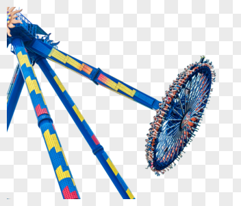

# skeleton animation
## 骨骼动画之前向动力学


把大摆锤上的游客当成动画角色网格上的顶点，每个游客的位置就是摆锤末端的位置加上游客相对摆锤末端的位移。
### Bind Pose 
确定游客相对摆锤末端的位移


### 前向动力学 
确定摆锤末端的位置


从上图可以看出关节(摆锤末端)坐标系到模型空间(root节点为中心的空间)的变换，就是根节点到该关节的变换矩阵之乘积

### 计算骨骼节点初始状态的位置


inverseBindMatrices用来快速计算顶点在对应骨骼中的相对位置(所谓的骨骼空间)，
后面章节会用到

我们将从动画根骨骼(Hips)开始计算各个骨骼节点的位置，
注意Hips骨骼的父节点才是根节点（在模型空间的位置为vector3.zero）。

### 代码流程
gltf中的"nodes"节点中包含了骨骼节点的初始变换矩阵


```
getLocalMatrix()
{
    return glm::translate(glm::mat4(1.0f), translation) * glm::mat4(rotation) * glm::scale(glm::mat4(1.0f), scale);
}
```
从根节点开始广度遍历，计算出各个骨骼节点在模型空间中的位置
```
void GetNodePos(glm::mat4 parentMat/*,glm::vec4 pos*/, std::vector<ShaderVertex>& pos,std::vector<uint16_t>& indices)
{
    auto matrix = getLocalMatrix();
    parentMat =  parentMat * matrix;
    auto nodePos = parentMat * glm::vec4(0, 0, 0, 1);
    ShaderVertex vertex{ {nodePos[0],nodePos[1],nodePos[2]} };
    //vertex.color = glm::vec3(1.0f, 0.0f, 0.0f);
    vertex.color = glm::vec3(pos.size() / 20.0f, 0.0f, 0.0f);
    pos.push_back(vertex);
    auto parentIndex = pos.size() - 1;
    
    for (size_t i = 0; i < children.size(); i++)
    {
        indices.push_back(parentIndex);
        indices.push_back(parentIndex + 1);
        children[i]->GetNodePos(parentMat,pos,indices);  
    }
}
```
### 将骨骼节点的位置以线的模式渲染效果如下：


