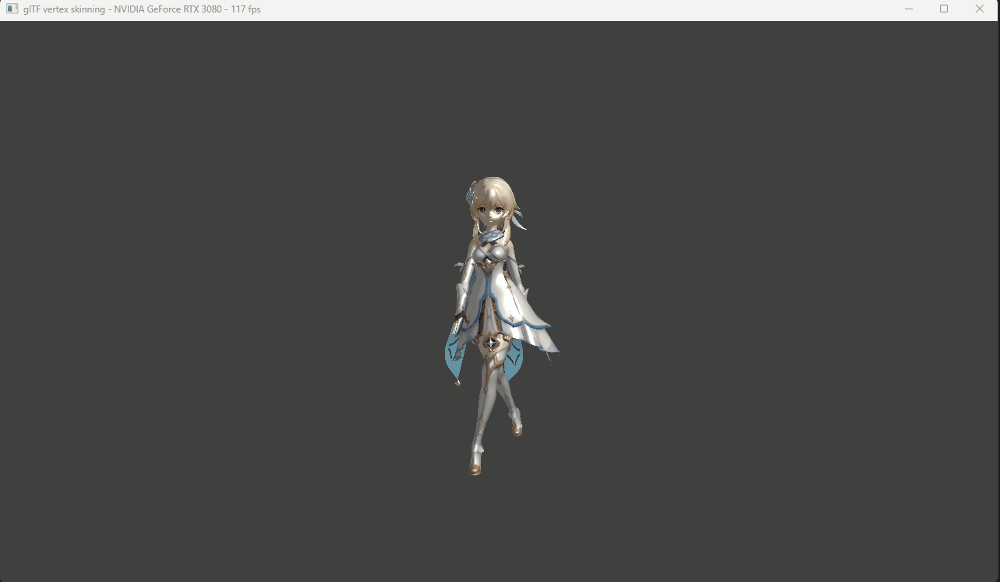

# skeleton animation
## 骨骼蒙皮

从上图可以看出Hips骨骼对顶点的影响权重，一个顶点可以被多个骨骼影响。
蒙皮绑定权重在gltf的数据如下

JOINTS_0存储了骨骼索引
WEIGHTS_0存储了对应的骨骼权重

## 计算Mesh顶点在模型空间中的位置
```
layout (location = 0) in vec3 inPos;
layout (location = 1) in vec3 inNormal;
layout (location = 2) in vec2 inUV;
layout (location = 3) in vec3 inColor;
layout (location = 4) in vec4 inJointIndices;
layout (location = 5) in vec4 inJointWeights;

layout (set = 0, binding = 0) uniform UBOScene
{
	mat4 projection;
	mat4 view;
	vec4 lightPos;
} uboScene;

layout(push_constant) uniform PushConsts {
	mat4 model;
} primitive;

layout(std430, set = 1, binding = 0) readonly buffer JointMatrices {
	mat4 jointMatrices[];
};

layout (location = 0) out vec3 outNormal;
layout (location = 1) out vec3 outColor;
layout (location = 2) out vec2 outUV;
layout (location = 3) out vec3 outViewVec;
layout (location = 4) out vec3 outLightVec;

void main() 
{
	outNormal = inNormal;
	outColor = inColor;
	outUV = inUV;

	// Calculate skinned matrix from weights and joint indices of the current vertex
	mat4 skinMat = 
		inJointWeights.x * jointMatrices[int(inJointIndices.x)] +
		inJointWeights.y * jointMatrices[int(inJointIndices.y)] +
		inJointWeights.z * jointMatrices[int(inJointIndices.z)] +
		inJointWeights.w * jointMatrices[int(inJointIndices.w)];

	gl_Position = uboScene.projection * uboScene.view * primitive.model * skinMat * vec4(inPos.xyz, 1.0);
}
```
gltf中的绑定矩阵数据如下


inPos是顶点在BindPose下模型空间中的位置，inverseBindMatrices矩阵对应某一骨骼空间到模型空间的变换矩阵的逆矩阵，可将inPos顶点变换到骨骼的局部空间中的位置Bone_local_pos，然后将动画某一帧所确定的骨骼空间到模型空间的变换矩阵乘以Bone_local_pos，得到新的模型空间下的顶点位置。
```
glm::mat4 vkglTF::Model::getNodeMatrix(vkglTF::Node* node)
{
	glm::mat4              nodeMatrix = node->localMatrix();
	vkglTF::Node* currentParent = node->parent;
	while (currentParent)
	{
		nodeMatrix = currentParent->localMatrix() * nodeMatrix;
		currentParent = currentParent->parent;
	}
	return nodeMatrix;
}

glm::mat4 vkglTF::Node::localMatrix() {
	return glm::translate(glm::mat4(1.0f), translation) * glm::mat4(rotation) * glm::scale(glm::mat4(1.0f), scale) * matrix;
}
```
getNodeMatrix()函数计算出骨骼空间到模型空间的变换矩阵。由localMatrix()函数中的translation,rotation,scale
从动画信息中各channel中关键帧中采样即可得到，代码如下
```
for (auto& channel : animation.channels) {
		vkglTF::AnimationSampler &sampler = animation.samplers[channel.samplerIndex];
		if (sampler.inputs.size() > sampler.outputsVec4.size()) {
			continue;
		}

		for (auto i = 0; i < sampler.inputs.size() - 1; i++) {
			if ((animation.currentTime >= sampler.inputs[i]) && (animation.currentTime <= sampler.inputs[i + 1])) {
				float u = std::max(0.0f, animation.currentTime - sampler.inputs[i]) / (sampler.inputs[i + 1] - sampler.inputs[i]);
				if (u <= 1.0f) {
					switch (channel.path) {
                        case vkglTF::AnimationChannel::PathType::TRANSLATION: {
                            glm::vec4 trans = glm::mix(sampler.outputsVec4[i], sampler.outputsVec4[i + 1], u);
                            channel.node->translation = glm::vec3(trans);
                            break;
                        }
                        case vkglTF::AnimationChannel::PathType::SCALE: {
                            glm::vec4 trans = glm::mix(sampler.outputsVec4[i], sampler.outputsVec4[i + 1], u);
                            channel.node->scale = glm::vec3(trans);
                            break;
                        }
                        case vkglTF::AnimationChannel::PathType::ROTATION: {
                            glm::quat q1;
                            q1.x = sampler.outputsVec4[i].x;
                            q1.y = sampler.outputsVec4[i].y;
                            q1.z = sampler.outputsVec4[i].z;
                            q1.w = sampler.outputsVec4[i].w;
                            glm::quat q2;
                            q2.x = sampler.outputsVec4[i + 1].x;
                            q2.y = sampler.outputsVec4[i + 1].y;
                            q2.z = sampler.outputsVec4[i + 1].z;
                            q2.w = sampler.outputsVec4[i + 1].w;
                            channel.node->rotation = glm::normalize(glm::slerp(q1, q2, u));
                            break;
                        }
					}
				}
			}
		}
	}
```
JointMatrices = getNodeMatrix() * inverseBindMatrices
将JointMatrices数据传入顶点着色器中，渲染效果如下：



